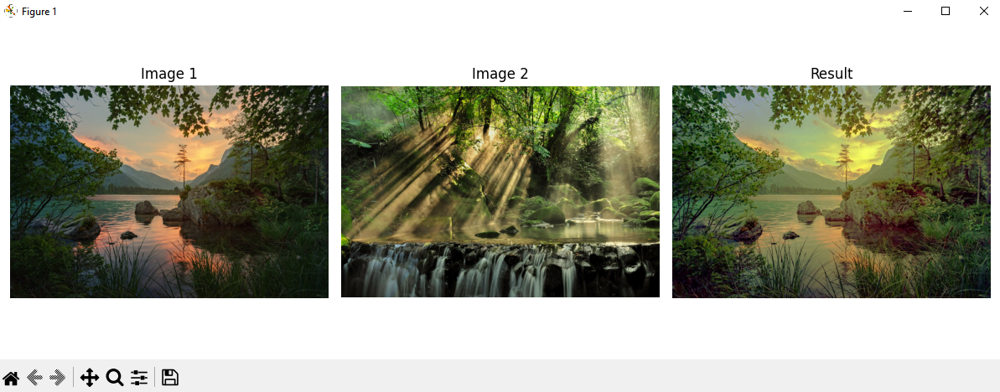

# Image Processing

## Description
The package package_name is used to:  
- Processing:
	- Histogram matching
	- Structural similarity
	- Resize image  
- Utils:
	- Read image
	- Save image
	- Plot image
	- Plot result
	- Plot histogram

## Installation

Use the package manager [pip](https://pip.pypa.io/en/stable/) to install package_name

```bash
pip install image_processing
```

## Usage
### For Histogram Matching
1. Import the modules to open, read, plot, and save the imagens you need to combine as well as the combination module:  
```python
from image_processing.utils import io, plot
from image_processing.processing import combination
```
2. Get both images' paths:
	- a base image which is going to be modified
	- the reference image to get the histogram to be applied on the base image  

	It is easier if you store their paths in two variables, like the example below:
```python
image_1_path = io.read_image(image_1_path)
image_2_path = io.read_image(image_2_path)
```
3. Combine the images using the transfer_histogram passing as its arguments the base image (image_1), and the histogram reference image(image_2), storing it in a variable (result_image):
```python
result_image = combination.transfer_histogram(image_1, image_2)
```  
4. You can plot the results in two diferent ways:
	- Comparing the three images using the plot_result and passing the images as the arguments:
		```python
		plot.plot_result(image_1, image_2, result_image)
		```
		  
	
	- Ploting only the result image with the plot_image:
		```python
		plot.plot_image(result_image)
		``` 
		  

5. Finally you can save the result_image using the io.save_image, passing the result image and the path to where you want to save it.
	```python
	result_img_path = "./image-processing-package/result_image.jpg"
	io.save_image(result_image, result_image)
	```

## Author
Thiago Ferrari

## License
[MIT](https://choosealicense.com/licenses/mit/)